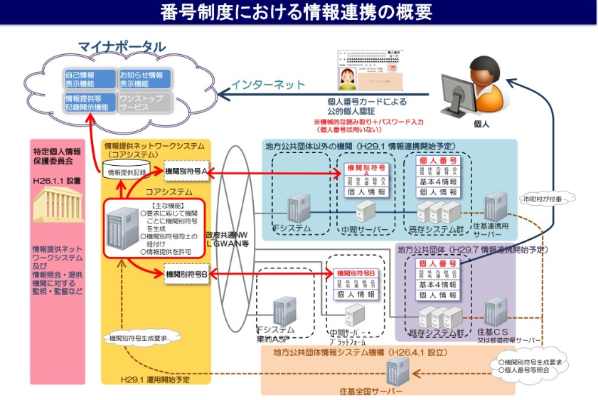

## はじめに

本記事は、e-Estonia連載の4本目である。

前回まで、エストニアが何をどう作ってきたのかを見てきた。ここからは日本の番になる。

ところが、いざ日本の電子政府について書こうとすると、その手前で困ることがある。そもそも、それを何と呼べばいいのかがはっきりしない。エストニアには、e-Estoniaというブランド名が20年以上前から存在する。一方の日本には、それに相当する定着した呼び名がない。

そこで本記事は、この連載で日本側を何と呼ぶのか、という定義から始めたい。

## e-Japanという言葉について

まず前提として、e-Japanは筆者の造語ではない。2001年1月に政府の高度情報通信ネットワーク社会推進戦略本部（IT戦略本部）が決定した、国家戦略の名称である。掲げられた目標は明確だった。5年以内に世界最先端のIT国家になる。

奇しくも同じ2001年、エストニアではX-Roadが稼働を開始している。あれから25年が経った2026年現在、エストニアは行政サービスの100％電子化を達成し（2024年）、日本は自治体システムの標準化の半ばにいる。どうやら日本は、まだ世界最先端のIT国家にはなれていないらしい。

話を戻そう。e-Japan戦略はその後、何度も看板を掛け替えられている。大まかな流れは次の通り。

- 2001年 e-Japan戦略 ／ IT基本法施行（成立は2000年11月）
- 2003年 e-Japan戦略II
- 2006年 IT新改革戦略
- 2009年 i-Japan戦略2015
- 2010年 新たな情報通信技術戦略
- 2013年 世界最先端IT国家創造宣言
- 2016年 官民データ活用推進基本法
- 2018年 世界最先端デジタル国家創造宣言
- 2021年 デジタル社会形成基本法（IT基本法は廃止）／デジタル庁発足
- 以降 デジタル社会の実現に向けた重点計画（毎年改定）

<!-- 確認済み：e-Japan戦略2001年1月22日（IT戦略本部決定）、e-Japan戦略II 2003年7月、IT新改革戦略2006年1月、i-Japan戦略2015は2009年7月6日、新たな情報通信技術戦略2010年5月（2009年の政権交代を受けてi-Japan戦略を引き継いだもの。当初の年表から抜けていたため追加）、世界最先端IT国家創造宣言2013年6月14日閣議決定、官民データ活用推進基本法2016年12月14日施行（平成28年法律第103号）、世界最先端デジタル国家創造宣言2018年6月15日閣議決定、デジタル社会形成基本法およびデジタル庁は2021年9月1日。なお2004年の u-Japan（総務省の構想）は、IT戦略本部決定の系列ではないため年表に含めていない -->

つまり、現在の正式な枠組みは、デジタル社会形成基本法とそれに基づく重点計画であって、e-Japanではない。名称としては、とっくに役目を終えている。

それでもこの連載でe-Japanという言葉を使うのは、e-Estoniaと並べたときに対比しやすいから、という単純な理由である。以降、e-Japanと書いたときは、2001年から現在までの日本の電子政府の取り組み全体を指すものとして読んでほしい。

## e-Japanの全体像

### 何を実現しようとしているのか

デジタル庁・総務省が掲げる大目標は、「誰一人取り残されないデジタル社会」を実現することである。とはいえ、この標語だけでは、何がどうなれば達成なのかが掴みづらい。実際には、そこへ至る道筋は大きく3段に分かれている。

1段目は、相手が誰なのかを確実に識別できるようにすることだ。全住民に番号を割り当てるマイナンバー制度、本人確認と電子署名を担う公的個人認証、給付金の振込先をあらかじめ登録しておく公金受取口座、そして法人向けのGビズIDが、ここに並ぶ。手続きをオンラインで完結させるには、まず画面の向こうにいるのが誰なのかを保証できなければ話が始まらない。

2段目は、自治体のシステムを揃えることである。自治体基幹業務システムの標準化と、その受け皿となるガバメントクラウドがこれにあたる。2025年を目標に進められてきたが、2026年現在は一部を延長して対応中だ。

3段目が、揃えたシステムをつなぐことになる。データ要件・連携要件標準仕様によって自治体間・制度間のデータ連携が成立すれば、一度提出した情報を別の手続きで使いまわせる「ワンスオンリー」や、複数の手続きが一箇所で完結する「ワンストップ」が視野に入る。

ここまで到達すれば、小規模な自治体でも大都市と同水準のデジタルサービスを提供できるようになる。地域格差が是正され、結果として「誰一人取り残されないデジタル社会」に近づく。これが政府の描いている筋書きである。

目指しているもの自体は、実はエストニアとそれほど変わらない。前回見たonce-only原則は、日本でも「ワンスオンリー」という言葉でほぼ同じように掲げられている。ただ、エストニアの話に「全国のシステムを揃える」という工程は出てこなかった。では、なぜ日本にはこの2段目が必要なのか。

### 2つの前提

日本の仕組みは要素が多く、一つずつ見ていくとすぐに迷子になる。そこで先に、全体を貫いている前提を2つ挙げておきたい。以降はこれを前提1・前提2と呼ぶ。ここから出てくる仕組みは、ほぼすべてこの2つの帰結として読める。

前提1は、データを持っているのは国ではなく自治体だという点である。エストニアでは、国が基盤を作り、国が運用し、国が国民のデータを持っている。一方で日本は、国が制度を作り、基盤を運用するが、データは自治体が保有している。これは効率の問題ではなく、地方自治という前提からきている。国が音頭を取っても、実データは1700以上の自治体に分かれて存在している。

前提2は、全システム共通のIDを作らないという点である。エストニアは個人識別コードを全システム共通の鍵として公然と使うが、日本は正反対で、機関をまたぐやり取りにマイナンバーそのものを使わない。個人情報は従来通り各機関が保有したままにし（分散管理と呼ばれる）、連携の際はマイナンバーの代わりに機関ごとに異なる符号を使う。

同じ「データを1か所に集めない」形に見えても、成り立ちは違う。エストニアのそれが統合する金も権限もなかったという制約の産物だったのに対し、日本のそれには、そう作らなければならない理由があった。その理由は2008年の住基ネット訴訟の最高裁判決まで遡るため、次回に譲る。ここではひとまず、そういう前提で作られているとだけ頭に入れておいてほしい。

<!-- ②の「マイナンバーの設計に影響を与えた最高裁判決」と突き合わせ済み。①では理由を明かさず「そう作らなければならない理由があった」と振り、②が「憲法判断が要請した設計だった」と受ける形にしてある。エストニア対比の逐語重複も解消済み -->

### アーキテクチャと登場人物

以上を踏まえたうえで、全体像を図にすると以下のようになる。

<!-- TODO：イメージこれだけど、多分著作権的に良くないしわかりづらいからちゃんと作る -->

実データは原則自治体が保有しており、機関をまたいだ連携を行う際には、情報提供ネットワークシステムが用いられる。この図を動かしている組織は多いので、主な登場人物も併せて整理しておきたい。

まずデジタル庁は、2021年9月1日発足で、デジタル社会形成の司令塔として位置づけられている。注意したいのは、まだ5年しかたっていないことだ。エストニアのRIAが2001年から基盤を運用し続けてきたのに対し、デジタル庁はすでに動いている仕組みの上に、あとから司令塔として置かれた組織になる。

総務省は、住民基本台帳制度、マイナンバーカードの交付、LGWAN（※後述）といった、地方自治に関わる基盤を所管する。その実務を担うのがJ-LIS（地方公共団体情報システム機構）で、マイナンバーカードの発行と公的個人認証サービスの運営主体であり、住基ネットの運用も担っている。

そして各自治体が、前提1で述べた通り、住民の情報を実際に保有している。日本の電子政府を理解するうえで、この点が非常に重要な点になる。

<!-- メモ：これってつまり、デジタル庁ができるまで、移行計画を素人が立ててたってことそりゃ失敗するやろ。 -->

### 主要な用語

図に出てくる用語を、先ほどの3段に沿って整理しておく。マイナンバー、マイナンバーカード、公的個人認証が1段目の「識別する」を担い、ガバメントクラウドが2段目の「揃える」の受け皿になり、LGWANと情報提供ネットワークシステムが3段目の「つなぐ」を支える。そして最後に、それらの上に乗る国民向けの窓口としてマイナポータルがある。

#### マイナンバー

全住民に割り当てられる12桁の番号である。位置づけとしてはエストニアの個人識別コードに対応するが、扱われ方はほとんど正反対になる。

まず、この番号は本人の意思と関係なく全員に割り当てられている。次に述べるマイナンバーカードの取得は任意なので、カードを持っていなければ番号もないと思われがちだが、そうではない。カードがなくても番号は振られている。

そのうえで、使える場面が法律で厳しく限定されている。税・社会保障・災害対策の3分野から始まり、順次拡大されてきた。前提2で触れた通り、機関をまたぐデータ連携にこの番号そのものは使われない。エストニアが個人識別コードを全システム共通の鍵として公然と使うのに対し、日本ではマイナンバーをむやみに他人へ見せないよう案内されている。同じ「全国民に振られた番号」でありながら、制度の中で置かれている位置がまるで違う。

#### マイナンバーカード

マイナンバーが記載され、ICチップに電子証明書を格納した物理カードである。番号そのものとは別物で、こちらは取得が任意になっている。

この「番号は全員に、カードは希望者に」という切り分けは、日本の制度を分かりにくくしている一因でもある。オンラインで手続きができるかどうかを実際に決めているのはカードの方であり、後述する普及率も、すべてこのカードの保有率の話になる。

#### 公的個人認証サービス（JPKI）

マイナンバーカードのICチップに格納された電子証明書を使って、本人確認と電子署名を行う仕組みである。エストニアのデジタルIDに技術的に対応するのはこれになる。証明書は利用者証明用と署名用の2種類があり、ログインに使うものと書類に署名するものが分かれている。エストニアがPIN1とPIN2で認証と署名を分けていたのと、同じ構造である。

ここで整理しておきたいのは、番号とカードで使える範囲が違うという点だ。マイナンバーの利用は法律で定められた範囲に限られるが、カードを用いた電子署名は民間でも使える。銀行口座の開設やオンラインの本人確認にマイナンバーカードが使えるのは、番号ではなくこちらの仕組みに乗っているからである。

#### ガバメントクラウド

国と自治体が共通で利用するクラウド基盤である。

これまで1700以上の自治体が、それぞれ個別にシステムを調達し、個別に運用してきた。その基盤部分を共通化しようというのがガバメントクラウドで、2段目の自治体基幹業務システムの標準化と対で進められている。標準化が業務の仕様を揃える取り組みだとすれば、ガバメントクラウドは揃えたものを載せる場所にあたる。

#### LGWAN（総合行政ネットワーク）

自治体間、および国と自治体を結ぶ、インターネットから分離された行政専用のネットワークである。

ここはエストニアとの発想の違いが出やすいところになる。X-Roadは、どんなネットワークの上を通るかに依存しない設計になっている。安全性は、相互証明書によるTLS認証、メッセージへの電子署名、タイムスタンプ、そしてログといった、通信路よりも上のレイヤーで担保されているからだ。対して日本は、ネットワークそのものを物理的に分ける方法を取った。通信路を閉じてしまう、という考え方である。堅牢ではあるが、外部のサービスとつながりにくいという代償も伴う。

<!-- 確認済み：X-Road公式ドキュメント（docs.x-road.global, Architecture）に「X-Road is decentralized – the data exchange happens directly between organizations」「The protocol is based on HTTPS and uses mutual certificate-based TLS authentication」「The security server encapsulates the security aspects ... managing keys for signing and authentication, sending messages over secure channel, creating the proof value for messages with digital signatures, time-stamping ... and logging」と明記。ただし「公開インターネット上で動作する」とは書かれておらず、下位ネットワークの前提は文書化されていないため、レイヤーの話として書いている -->

#### 情報提供ネットワークシステムと中間サーバ

機関を跨いでデータをやり取りするための仕組みで、位置づけとしてはX-Roadに相当する。

前提2で述べた符号の変換を実際に担っているのがこの仕組みである。連携の際にはマイナンバーの代わりに機関ごとに異なる符号が使われ、情報提供ネットワークシステムがその変換を行う。連携できる情報そのものも、マイナンバー法の別表で定められたものに限られている。

同じ人物でも、年金機構での符号と自治体での符号は別の値になる。ある機関から情報が洩れても、他機関の情報が芋づる式に辿れない、という考え方だ。

そして中間サーバは、各機関が連携用に手前へ置くサーバである。連携対象となるデータの副本をここに持たせ、外部からの照会には基幹システムを直接叩かずにこのサーバが応える。エストニアで各機関がSecurity Serverを立てるのと、置かれる位置としては似ている。

<!-- 確認済み：総務省「マイナンバー制度による情報連携」（令和2年5月、内閣官房番号制度推進室・総務省大臣官房個人番号企画室） https://www.soumu.go.jp/main_content/000691748.pdf 。「行政機関等は、マイナンバー法に基づき、互いに情報の照会と提供を行う個人の情報について、中間サーバーに副本情報として登録・管理し、情報提供ネットワークシステムを通じて情報連携する仕組み」と明記。また情報提供ネットワークシステムは、機関別符号の生成・変換を行うコアシステム（総務省設置）と、中間サーバー等に接続するインターフェイスシステムで構成される -->

#### マイナポータル

自分に関する行政の保有情報を確認したり、申請を行ったりするための、国民向けの窓口である。エストニアで言えばeesti.eeに相当する位置づけになる。

ここまでに挙げた仕組みは、いずれも裏側で動くものだった。マイナポータルはその上に乗る表側にあたり、国民が実際に目にするのはほぼこの画面になる。

機能のひとつに、自分の情報が他の機関へ提供された履歴の確認がある。前回、エストニアでは国民が専用ポータルから「誰が自分のデータを見たか」を確認でき、それがSecurity Serverのmessage logの上に成り立っていると書いた。日本でも情報提供ネットワークシステムが連携の記録を残しており、それをマイナポータルから辿れる。透明性を担保する仕組みは、制度としては日本にも存在している。

## e-Japanで何ができるのか

ここまでは、e-Japanが何を作ろうとしていて、それがどういう構造になっているのかを見てきた。いわば設計図の話である。最後に、その部品を使って実際に何ができるようになっているのかを見ておきたい。なお、e-Japanは今も動き続けているプロジェクトであり、時間とともに情報は変わっていくため、あくまで2026年9月時点の話であるという点はご留意いただきたい。

マイナンバーカードを使うことで、少しずつではあるが、一部行政サービスがオンラインで受けられるようになっている。利用可能な代表的なサービスは以下の通り。

- 確定申告（e-Tax）をはじめとするオンライン申請
- コンビニでの住民票・印鑑登録証明書などの取得
- 健康保険証としての利用（マイナ保険証）
- 運転免許証としての利用（マイナ免許証）
- 引っ越しの際の転出届のオンライン提出
- 民間サービスでの本人確認

また、電子証明書自体も、スマートフォンへの搭載が進んでおり、2023年にはAndroid端末で、2025年にはiPhoneで利用可能になっている。

こうして並べると、できることは着実に増えてきている。ただ、3段のうち達成できているのは1段目までで、2段目の標準化は道半ば、3段目のワンスオンリーに至ってはまだ多くの人の生活に届いていない。設計図はあるが、建物はまだ建ちきっていない、というのが現在地である。

## さいごに

ここまでで、e-Japanが何を目指し、どういう構造になっているのかを見てきた。

構想と実態の間には、まだ距離がある。ただ、その距離は「やる気がなかったから」や「技術力が足りなかったから」では説明がつかない。日本は2001年の時点で世界最先端を目標に掲げ、住民基本台帳ネットワークを2002年に稼働させ、IDカードも配っている。エストニアと同じ時期に同じようなことを始めていた。

では何が違ったのか。

次回は、日本がこれまでどのような取り組みを行ってきて、その結果として今の形があるのかについて詳しく見ていく。

## 出典メモ

<!--
凡例： [済] 一次資料または準一次資料で確認済み（確認した値を併記）／ [未] 未確認。
確認日：2026年9月12日。
総務省のPDFは pdftotext -layout で本文を抽出できる（Readツールは pdftoppm を要求するため不可）。
-->

### [済] 確認済み

- **e-Japan戦略**：2001年1月22日、IT戦略本部（高度情報通信ネットワーク社会推進戦略本部）決定。目標文言は「5年以内に世界最先端のIT国家となることを目指す」。
  - https://ja.wikipedia.org/wiki/E-Japan戦略
  - 後継戦略の確認できた年次：e-Japan重点計画（2001年3月29日）、e-Japan2002プログラム（2001年6月26日）、e-Japan戦略II（2003年7月）、IT新改革戦略（2006年1月）
  - 首相官邸サイトの原文にはまだ到達していないため、公開前に原文で最終確認したい
- **X-Roadのアーキテクチャ**：公式ドキュメントに次の記述を確認。
  - https://docs.x-road.global/Architecture/arc-g_x-road_arhitecture.html
  - 「X-Road is decentralized – the data exchange happens directly between organizations」
  - 「The protocol is based on HTTPS and uses mutual certificate-based TLS authentication」
  - 「The security server encapsulates the security aspects of the X-Road infrastructure: managing keys for signing and authentication, sending messages over secure channel, creating the proof value for messages with digital signatures, time-stamping...and logging」
  - 「Central server manages the database of X-Road members and security servers. In addition, the central server contains the security policy of the X-Road instance」（security policy ＝ 信頼できるCA・タイムスタンプ局のリスト等。HTTPでSecurity Serverへ配布）
  - 補足：X-Roadの通信経路については https://x-road.global/x-road-technology-overview にも「all the data is exchanged directly between a service consumer and a service provider」とある

- **分散管理・機関別符号・中間サーバ・情報提供ネットワークシステム**：総務省「マイナンバー制度による情報連携」（令和2年5月、内閣官房番号制度推進室・総務省大臣官房個人番号企画室）で次を確認。
  - https://www.soumu.go.jp/main_content/000691748.pdf
  - 参考： https://www.soumu.go.jp/main_content/000429540.pdf （総務省「マイナンバー制度における情報連携について」平成28年5月）
  - 「従来どおり個人情報は各行政機関等が保有し、他の機関の個人情報が必要となった場合には、マイナンバー法別表第二で定められるものに限り、情報提供ネットワークシステムを使用して情報の照会・提供を行う『分散管理』の方法をとる」
  - 「行政機関等は、マイナンバー法に基づき、互いに情報の照会と提供を行う個人の情報について、中間サーバーに副本情報として登録・管理し、情報提供ネットワークシステムを通じて情報連携する仕組みとしている」
  - 情報提供ネットワークシステムは番号法に基づき総務大臣が設置・管理。機関別符号の生成・変換を行うコアシステム（総務省設置）と、中間サーバー等に接続するインターフェイスシステムで構成される
  - 情報提供ネットワークシステムによる情報連携は2017年7月開始
- **エストニア側の数値**：連載1〜3本目の出典メモで確認済み。本記事の記述と整合している。
  - X-Roadは2000年にパイロット開始、2001年12月に本格稼働（本文「同じ2001年に稼働を開始」と整合）。`e-estonia1.md` の出典メモ参照
  - eID利用率85%は Eurostat の「自国の行政サービスにeIDを使った割合」（2025年）。同指標のEU平均は46%。なお「オンラインサービス全般」という別指標ではエストニア91%・EU平均52%で、混同しやすいので注意。`e-estonia1.md` の出典メモ参照

- **LGWAN（総合行政ネットワーク）**：地方公共団体情報システム機構（J-LIS）が運営する、全国の地方公共団体を相互に接続する行政専用の閉域ネットワーク。インターネットからは切り離されている
  - https://www.j-lis.go.jp/lgwan/about/cms_15039.html
  - https://www.j-lis.go.jp/file/L-2_gaiyou_Internet_201904_1.pdf
- **JPKIの電子証明書が2種類である点**：「署名用電子証明書」（e-Taxの確定申告など文書を伴う電子申請に使う、実印に相当）と「利用者証明用電子証明書」（オンライン手続きでのログイン時の本人確認に使う）の2種類がマイナンバーカードに搭載される
  - https://www.jpki.go.jp/prepare/digital_certificate.html
  - https://www.soumu.go.jp/kojinbango_card/kojinninshou-01.html
- **デジタル庁発足（2021年9月1日）とIT基本法の廃止**：デジタル社会形成基本法の施行が2021年9月1日。同法はデジタル庁設置の根拠を規定し、これに伴いIT本部（IT戦略本部）は廃止された
  - https://www.digital.go.jp/assets/contents/node/basic_page/field_ref_resources/d12bde7e-a950-493b-987c-0f8d4bbd1b6b/20210901_laws_r3_37_outline.pdf
- **マイナンバーが12桁である点**：住民票のあるすべての住民に12桁の個人番号が付番される（2015年10月の通知カードで通知）

- **X-Roadと下位ネットワークの関係**：公式ドキュメントには、データ交換が組織間で直接行われること（decentralized）、転送プロトコルがHTTPS＋相互証明書TLS認証であること、Security Serverが鍵管理・署名・タイムスタンプ・ログを担うことは明記されているが、**どのようなネットワークの上を通るかは記述されていない**。したがって「X-Roadは公開インターネット上で動く」とは断定できない。本文はこれを踏まえ、「網に依存せず、安全性を通信路より上のレイヤーで担保する設計」として書いており、LGWANの「網そのものを閉じる」設計との対比はこの形で成立している
  - https://docs.x-road.global/Architecture/arc-g_x-road_arhitecture.html
- **自治体数「1700以上」**：全国の市町村数は1,718（市792・町743・村183）。東京23区（特別区）を加えると1,741市区町村。本文の「1700以上」はいずれの数え方でも正しい
  - https://www.j-lis.go.jp/spd/code-address/kenbetsu-inspection/cms_1014151.html
  - https://www.soumu.go.jp/kouiki/kouiki.html
- **IT基本法の年**：本文の年表は「2001年 e-Japan戦略 ／ IT基本法施行（成立は2000年11月）」として、施行年を主に置き成立年を括弧で補う形に整理済み
- **2026年7月決定の重点計画とAXの位置づけ**：2026年7月21日に「デジタル社会の実現に向けた重点計画」が閣議決定された。AXは「AIを前提として意思決定や業務の進め方を根底から見直すこと」と定義され、生成AI・AIエージェントを活用する「AX/DX」の推進が掲げられている。重点は4本柱（国のAX/DX基盤の高度化・強靱化／自治体のAX/DX基盤の高度化・強靱化／国民の暮らしのAX/DX推進／AX/DXの徹底的推進による経済成長の加速）。ガバメントAI「源内」は令和8年度に全府省庁対象の実証、令和9年度以降の本格利用開始を目指すとされる
  - https://www.watch.impress.co.jp/docs/news/2126624.html
  - 現時点では本文に反映していない（年表は「以降 デジタル社会の実現に向けた重点計画（毎年改定）」で止めている）。最新動向として触れるかは編集判断

### [未] 未確認

（本記事に関する未確認項目はなし）
