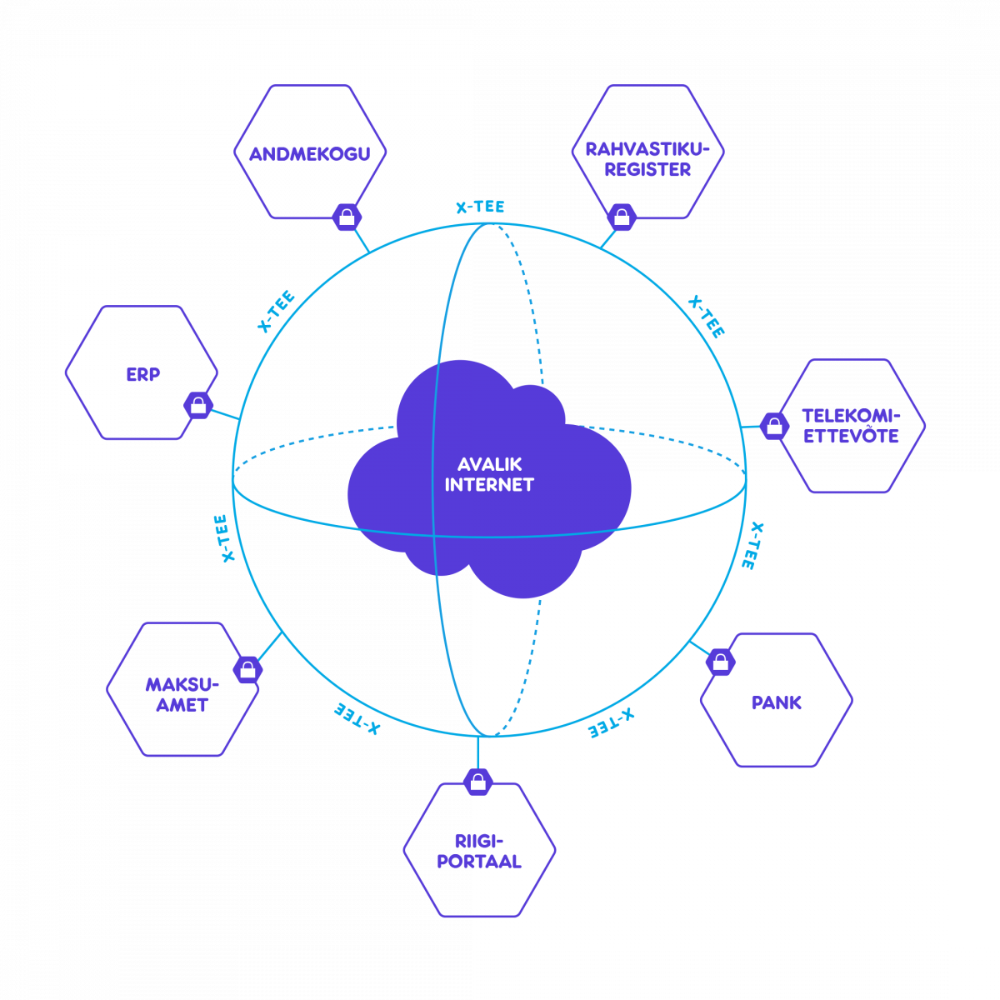
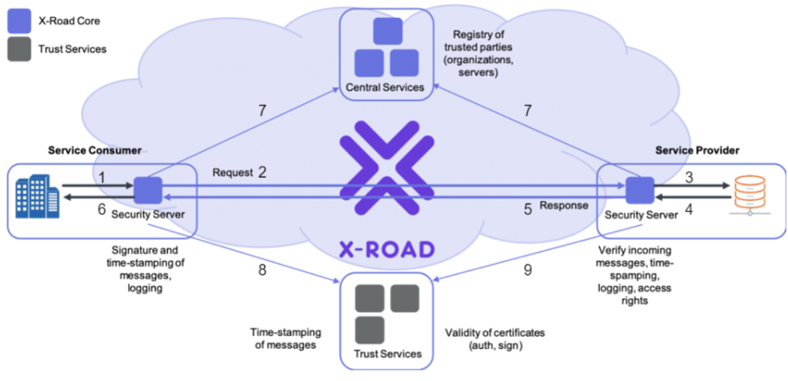

## はじめに

「エストニアは世界で最もデジタル化が進んだ国」——そう聞いても、では具体的に何がどうすごいのか、その裏側でどんな技術が動いているのかまで説明できる人は多くない。本記事は、その曖昧さを一歩踏み込んで解きほぐすことを狙っている。

本記事は、e-Estonia連載の2本目である。連載全体では、最終的にe-Estoniaがなぜうまくいったのか、そしてe-Japanに生かせる点はないかを考えたい。その前提として、本記事ではe-Estoniaそのものを詳しく見ていく。具体的には、まずそもそもe-Estoniaとは何なのか、何ができるのかというところから始め、どのような経緯を経て設計・開発・運用され、今に至るのかを追っていく。

## e-Estoniaとは何か

エストニアは「世界で最もデジタル化が進んだ国」として紹介されることが多い。ただ、その紹介のされ方は「行政手続きが3分で終わる」「投票もオンライン」といった事例の羅列になりがちで、e-Estoniaとは結局何を指しているのか、という部分は曖昧なまま残ることが多い。

e-Estoniaは実は特定のシステムやサービスの名前ではない。エストニアが1990年から進めてきた国家のデジタル化、その取り組み全体を指す。また、対外的な発信に使うブランド名であり、国の広報用語でもある。
本記事では、e-Japanとの比較というテーマを扱いたいため、Estoniaが提供する行政サービス全般を指すこととする。

### e-Estoniaで何ができるのか

仕組みの話に入る前に、まずは具体的に何ができるのかを見ておきたい。エストニア政府は、国民向けにおよそ600、企業向けにおよそ2400の電子サービスを提供している。そのすべてを挙げることはできないので、生活のいくつかの場面に沿って代表的なものを眺めてみる。

最も身近なのはおそらく税だろう。所得税の申告は、雇用主や銀行から集められたデータがあらかじめ入力された状態で表示され、国民は内容を確認して送信するだけで完了する。自分で金額を計算して書き写す、という作業そのものが存在しない。医療も同じように電子化されていて、医療記録は個人に紐づいて管理されるため、引っ越しや転院でデータが途切れることがない。2010年に導入された電子処方箋もこの上に乗っていて、薬局では身分を示すだけで処方薬を受け取れる。

企業活動に目を向けると、会社の設立すらオンラインで完結する。この「オンラインで法人を作れる」という仕組みが、のちに非居住者へも門戸を開くe-Residencyの土台になった。そして政治参加の領域にまで電子化が及んでいるのがエストニアの際立った点で、2005年の地方選挙以降、インターネット経由での投票が可能になっている。国政選挙でも利用できる。

こうした目立つサービスのほかにも、学校の成績や出欠の確認、各種証明書の取得、車両登録、さらには警察が職務質問の際に免許証を照会する、といった場面にまで電子化は及んでいる。行政と国民が接するほぼあらゆる接点が、紙ではなくデジタルを前提に設計されている、と言ってよい。

ただし、すべてがオンラインで完結するわけではない。エストニアは行政サービスの100％デジタル化を掲げているが、婚姻や離婚といった手続きには、プロセスの一部に対面を残しているものがある。これは技術的にできないからではなく、人生を左右する重大な決定は、むしろ画面の中だけで完結させるべきではない、という考え方によるものだ。技術的に可能かどうかと、そうすべきかどうかは別だ、という線引きが意図的になされている。

これだけのことが日常的に使われているわけだが、ではその裏側はどういう仕組みで動いているのか。ここからはe-Estoniaを支える技術的な土台に踏み込んでいく。

### e-Estoniaの全体アーキテクチャ

エストニアのデジタル基盤を理解するうえでの出発点は、「国民が一度提出した情報は、二度とどの役所からも求められない」という原則である。これは once-only principle と呼ばれ、EUもデジタル行政の基本方針として掲げている。住所を役所Aに登録したら、役所Bはその住所を自分で役所Aに取りに行く。国民に同じ情報を何度も書かせない、という考え方だ。

この原則を技術的に成立させるには、大きく2つの道がある。各機関のデータを一箇所に集めた中央データベースを作るか、あるいは各機関がデータを持ったまま相互に参照し合える仕組みを作るか、である。エストニアが選んだのは後者だった。各省庁・各サービスはそれぞれ独自にデータを保持し続け、必要なときにだけ、データ連携基盤である X-Road を通じて他機関のデータを取りに行く。中央に全国民のデータを集めた巨大なデータベースは存在しない。図では以下の通り。

以下で主要な概念について説明していく。

#### X-Road（X-tee）

各機関のシステム間でデータをやり取りするための分散型の基盤である。

ここで技術的にもう一歩踏み込んでおきたい。上記の図を見ると、国が中央にデータ連携用のサービスを一つ提供していて、各機関がそのパイプに接続しているように見える。しかし実態は違う。X-Road は中央を経由してデータを流す仕組みではなく、データのやり取り自体は機関同士が直接 P2P で行っている。

これを実現しているのが Security Server である。X-Road に参加する各機関は、自分のシステムの手前に Security Server と呼ばれるコンポーネントをサイドカーのように立てる。あるサービスが他機関のデータを欲しいとき、リクエストは自分の Security Server を経由し、相手機関の Security Server へ直接届く。つまり国が一本の太いパイプを提供しているのではなく、各機関が自前で立てた Security Server 同士が網の目状につながっているのが X-Road の実体である。

そして Security Server は単なる中継プロキシではない。初対面の機関同士でも安全にやり取りできるよう、相手との相互TLS認証、送信するメッセージへの電子署名、タイムスタンプの付与、そして全てのやり取りのログ記録（message log）を担っている。特にログは重要で、「いつ・どの機関が・誰のデータを・どの機関から取得したか」が改竄できない形で記録される。エストニアでは国民が専用ポータルから「誰が自分のデータを閲覧したか」を確認でき、正当な理由のないアクセスは追跡・摘発の対象になる。この透明性は、まさにこの message log の上に成り立っている。

では中央には何もないのかというと、そうではない。Central Server という中央コンポーネントは存在する。ただしその役割はデータの中継ではなく、「誰を信じてよいか」の管理である。X-Road に正式に参加している機関はどれか、信頼してよい Security Server はどれか、証明書を発行してよいCAやタイムスタンプ局はどれか——こうした信頼の名簿を Central Server が global configuration としてまとめ、署名付きで全 Security Server に配布している。各 Security Server はこの配布情報をもとに、目の前の通信相手が正規の参加者かどうかを検証する。ちなみに、この global configuration は各 Security Server にキャッシュされるため、仮に Central Server が一時的に落ちても、有効期限が切れるまではデータ連携そのものは動き続ける。中央が止まって困るのは新規メンバーの登録や信頼情報の更新であって、日々のやり取りではない。

まとめると、X-Road とは「中央のデータ連携サービス」ではなく、各機関が自前で立てる Security Server 同士の P2P ネットワークと、その信頼関係を管理・配布する Central Server、の組み合わせである。データは分散したまま、信頼だけを中央で束ねる。この「データは集めず、信頼を束ねる」構造こそが、単一の巨大DBを作らずに once-only を成立させている鍵になっている。

#### デジタルID

全国民に発行される電子的な身分証明で、物理的なIDカード、Mobile-ID、Smart-IDの3形態がある。

技術的な中身は共通していて、いずれも公開鍵暗号（PKI）に基づいている。各人には認証用と署名用の2つの鍵ペアが割り当てられ、認証にはPIN1、電子署名にはPIN2という別々の暗証番号を使う。ログインする行為と、書類に「ハンコを押す」行為とが、鍵のレベルできちんと分離されているイメージである。

3形態の違いは、この秘密鍵をどこに置くかにある。物理IDカードは鍵をカード内のICチップに格納するため、利用には専用のカードリーダーが要る。Mobile-IDは鍵をSIMカードに載せることで、カードリーダーなしに電話番号だけで認証・署名ができる。そしてSmart-IDは、SIMにすら依存しない。秘密鍵を2つに分割し、片方を利用者のスマホ、もう片方をサーバ側に置くことで、どちらか一方だけでは署名を完成できない仕組み（split-key方式）になっている。この方式はthreshold暗号に基づいており、EUのeIDAS規則の下で最高水準の署名手段である適格署名生成装置（QSCD）としても認定されている。物理カードは今も身分証として存在しているが、日常的な認証手段としては後発の2つに置き換わっている。

非居住者向けにも、デジタルIDを発行する制度があり、e-Residencyと呼ばれる。

なお、こうしたX-Roadをはじめとする国家基盤を運用している主体が、情報システム庁（RIA）である。

## e-Estoniaの歴史

いまでこそ、エストニアの電子行政は高い利用率を誇っている。EUの統計では、2025年に電子的な身分証明を使って自国の行政サービスにアクセスしたと回答した人の割合は、エストニアで85％にのぼった。EU平均は46％、ドイツやスロバキアのように15％以下にとどまる国もあることを踏まえると、その高さは際立っている。

しかし、この利用率は最初から達成されていたわけではない。デジタルIDの配布が始まった当初は、カードは配られたものの、電子的にはほとんど使われない状態が数年続いた。何がその状況を変えたのか——これがこの連載の中心的な問いになる。

ここまでで、e-Estoniaが中央集権的なシステムではなく、各機関がそれぞれデータを持ったままつながる構造になっていることを見てきた。ここからはその問いに答えるべく、なぜそういう構造になり、どうやって普及していったのかを時系列で追っていく。個人的には、この構造は優れた設計思想の産物というよりは、それ以外に選べなかった結果という側面が強いように感じる。

### 1991~2001年：e-Estonia前史

#### 何もなかったところから始まった

1991年、エストニアはソ連から独立を回復した。人口は150万人、国家機構を1から組み立て直す必要があったが、この時のエストニアは、以下の3つの要素から、必然的にデジタル化を進めることとなった。

まず1点目は、デジタル人材の蓄積である。1960年にソ連の戦略の一環としてサイバネティクス研究所が設立されており、そこでコンピュータプログラミングに特化した研究が行われていた。また、そこにはフィンランドの研究者も訪れており、西側の技術も取り入れられていた。のちに、この研究所が閉鎖された際には、民間企業や行政が研究者たちの受け皿となり、エストニア独立回復時点で、デジタル化に必要な人材がすでにエストニア内に存在した。

2点目は、この時点でエストニアには電子化を阻む既存の仕組みが存在しなかったことだ。紙の書類を前提とした行政組織も、そこに最適化された業務フローも、それを守ろうとする利害関係者も、ソ連から独立を回復した直後のため、まとまった形では引き継がれなかった。多くの国でデジタル化を難しくしているのは技術ではなく既存システムの置き換えコストだが、エストニアにはその負債がなかった。

そして3点目は、支店網や窓口といった物理的なインフラを全国に展開する余裕がなかったことだ。行政サービスをアナログで実施するためには、全国に窓口が必要だが、「1.エストニアという国について」で触れた通り、人口密度が低く（九州ほどの面積に長崎県民が住んでるイメージ）、また独立直後でお金もなかったため、その手段を取ることは難しかった。そのため、デジタル化という選択肢を取らざるを得なかった。

これら3つの要素が絡まりあい、エストニアは行政のデジタル化の方向に舵を切った。

#### 各省庁がバラバラにシステムを作った

前述の通り、システム化を進めたわけだが、当初は全体を統一的に設計する予算も、そうする権限を持つ組織もなかったため、1990年代を通じて、各省庁はそれぞれ独自にシステムを構築していった。

結果として90年代末のエストニアには、技術も設計思想もバラバラなシステムが各所に散在する状態が出来上がった。また、各システムベンダは、独自仕様で開発した非公開・非標準のソフトウェア/DBを利用したため、ベンダーロックインに苦しむことにもなった。しかし幸いにも、これがのちのオープン系・分散型アーキテクチャの出発点となった。

<!-- TODO: 90年代の具体的システム名は裏取りできず。人口登録簿(Rahvastikuregister)は2002年運用開始、オンライン納税e-Taxは2000年で、厳密には90年代の例として弱い。要再調査 -->

#### 銀行が認証インフラを必要としていた

e-Estoniaの成功において欠かせないのが銀行の存在である。銀行も政府と同様に、人・金の問題に直面しており、早い段階からデジタル化に取り組んでいた。
Hansapank（現Swedbank）は、1993年に電子バンキング（ATMや電話バンキングなどの専用線を使ったサービス。Telehansaと呼ばれた）を、1996年にはインターネットバンキングを開始していた。当時、インターネットバンキングサービスが利用可能だった銀行は、世界でわずか20行ほどで、その中に独立からわずか数年の国の銀行が入っていることからも、銀行のデジタル化の優先度が高かったことがうかがえる。

このように、銀行は早期からサービスのデジタル化に舵を切っていたが、二段階認証の仕組みに課題を抱えていた。当時のエストニアのインターネットバンキングでは、二段階認証の仕組みとして、紙のTANリスト（※TANリストの詳細は「おまけ：TANリストについて」を参照）が利用されていた。
この方法は、紙のリストの紛失リスクやネット犯罪（フィッシング詐欺・ハッキングなど）の標的になりやすいなどの問題があり、実際スウェーデンの大手銀行ではハードウェアトークン（キーホルダー型の小型専用端末）を顧客全員に配布し、そちらを利用していた。しかし、独立直後で資金体力もなかったエストニアでは、スウェーデン方式を採用することはコスト的に難しく、やむを得ずTANリストを利用していた。
当時のエストニアには、勘定系システムを保守できる規模のシステム会社が存在せず、人材を各銀行が自前で抱える必要があった。結果として銀行がIT産業の発展をけん引する立場になり、オンラインで二段階認証を行う仕組みを自ら開発できるだけの技術力も蓄えていた。

つまり、技術的にはよりセキュアな二段階認証を行うことはできたが、コストの問題でそれが実現できない状況にあった。

#### 国民全員にIDカードを配る構想が生まれる

国民全員にIDカードを配るという発想が出てきたのは1997年ごろだった。
独立回復直後の1992年、国民は一斉にエストニアのパスポートを取得した。パスポートの有効期限は10年、2002年に更新の波が来ることが確定していた。
そのため、この10年後に1度だけ訪れる波で新しい身分証を乗せるという判断だった。

そして政府は、このIDカードを用いて電子署名を行うことにより、人と文書の真正性を保証できることを目指していた。
そしてここで、前述の銀行と利害が一致した。IDカードによって、全国民が持ち、人の真正性を保証できる。それはまさに銀行がセキュアな二段階認証を行うために必要としていたものだった。
また政府としても、自前で認証の仕組み（電子署名に必要なCA）を開発・運用し、さらにIDカードを運用していくことはコスト面で厳しかった。しかし、これらを銀行と共同で担うことになり、構想が現実的となった。

この認証局（CA）の役割を担ったのが、2001年に二大銀行（Hansapank・Ühispank）と二大通信（Eesti Telefon・EMT）が共同で設立したAS Sertifitseerimiskeskus（SK）である。IDカードの証明書は、この銀行・通信の共同会社が発行する。国の側は、電子署名に手書き署名と同等の法的効力を与える法律（2000年のデジタル署名法）を成立させ、住民登録に基づいて全国民にカードを配るという普遍性を担保し、費用の一部も負担した。技術と運用は民間が、法的効力と普遍性は国が持ち寄る。エストニアのIDカードは、最初から官民共同のインフラとして立ち上がったのである。

#### バラバラなシステムを繋ぐ基盤としてX-Roadが生まれた

IDカードが「人の真正性」を担保する仕組みだとすれば、もう一つ必要だったのが「データをどう繋ぐか」の仕組みである。先に述べた通り、90年代のエストニアには各省庁がバラバラに作ったシステムが散在していた。ある手続きに必要な情報が複数の役所に分かれて存在し、国民は同じ情報を窓口ごとに書かされ、役所同士も互いのデータを参照できない。この「バラバラなシステムをどう繋ぐか」が、90年代末には現実的な課題になっていた。

素直な解決策は、全省庁のデータを集めた中央データベースを作ることだ。しかしエストニアはこれを選ばなかった。各機関はすでに独自の技術・設計でシステムを組んでおり、統合し直すコストは現実的でなかったうえ、全国民のデータを一箇所に集めることには安全保障・プライバシーの両面で懸念もあった。

そこで採られたのが、データは各機関が持ったまま、必要なときにだけ安全にやり取りするという、本記事の前半（全体アーキテクチャ）で説明したアプローチである。これを担う基盤としてX-Road（X-tee）が構築された。2000年に3つのデータベースを繋ぐパイロットとして始まり、2001年12月に本格的な稼働を開始している。開発を担ったのは、のちにe-Estoniaの多くの基盤技術を手がけることになる民間企業Cyberneticaだった。当初はごく少数のデータベースを繋ぐところから出発し、以降、接続先を増やしながら、いまでは1,000を超えるシステムをつなぐ国家のデータ連携の背骨へと育っていった。

ここで本章冒頭の見立てに戻りたい。X-Roadの分散型アーキテクチャは、優れた設計思想を先に掲げて選ばれたというより、「統合し直す余裕がない」「データを一箇所に集めたくない」という制約の帰結として立ち現れたものだった。制約が設計を決めた——エストニアの分散型アーキテクチャの出発点は、まさにここにある。

### 2002年~：IDカードの配布から普及まで

#### 配っただけでは使われなかった

2002年、ついに配布が開始した。このカードは15歳以上の国民に所持が義務付けられており、全国への配布は2006年に完了している。なお、この義務化という点について1点補足しておく。IDカード構想をエストニアに先立って実施したフィンランドは、義務化しなかったために普及に失敗している。そこからの助言を受けて、エストニアでは義務化とした。日本でも、マイナンバー導入時に義務化をしなかったためうまく普及せず、結果として後追いで8兆円近い金額を投じる必要があった。

話を戻してエストニアでは、全国民にカードはいきわたったが、電子的にはほとんど使われなかった。理由は単純で、使うのが面倒だったから。カードを使うには、専用のカードリーダ及び専用のソフトウェアが必要であり、当初はそこまでして使いたい行政サービスも特になかった。
<!-- TODO: 2000年代前半の「持っているが電子的に使わない」利用率の具体的数字は裏取りできず。要再調査 -->

#### 電子的な普及に貢献した3要素

この全員が持っているが特に活用していない状況を打破したのが主に以下の3点の要素である。

1点目が銀行がIDカードをログイン手段で受け入れた点である。前史で述べた通り、銀行での認証手段として、銀行独自のものからIDカードに変わった。行政サービスを使う頻度は年に数回だが、銀行は日常的に使う。国民がIDカードを日常的に使う理由は実は民間が作った。

2点目が、行政サービスの拡充である。2005年にインターネット投票、2008年に電子医療記録、2010年に電子処方箋、以降も着実に利用可能サービスを拡充していき、利用者のメリットを増やしていった。

そして3点目が、カードリーダーという物理的なハードルの解消である。2007年にMobile-ID、2017年にSmart-IDが登場し、本記事前半のデジタルIDの節で見た通り、カードリーダーを用意しなくてもスマートフォンだけで認証・署名ができるようになった。物理カードは身分証としては残ったものの、日常的な認証手段は後発のこの2つへ移り、「使うのが面倒」という最大の障壁が取り除かれていった。

### 普及後の主要な出来事

ここからは年表として短く追う。各項目の詳細は次章以降で扱う。

#### 2005 - インターネット投票

地方選挙でインターネット経由の投票が導入された。2007年の国政選挙でも実施され、国政レベルでの実施は世界初とされる。

#### 2007 - サイバー攻撃

ソビエト時代の記念碑の移設をめぐる対立を背景に、政府機関・銀行・報道機関などが大規模なサイバー攻撃を受けた。エストニアは1年以内にサイバーセキュリティ戦略を策定し、タリンにNATOのサイバー防衛協力センターが設置された。

この出来事はe-Estoniaの性格を変えたといわれる。詳細は次章で扱う。

#### 2014 - e-Residency

非居住者にデジタルIDを発行する制度が始まった。国内向けの仕組みを外部に開いたもので、e-Estoniaの対外的な知名度を大きく押し上げた。

#### 2017 - IDカードの脆弱性

チップに使われていた暗号ライブラリの欠陥（ROCA）により、2014年秋以降に発行された約75万枚のIDカードの証明書が停止された。

多くの国が物理的なカードの再発行で対応したのに対し、エストニアはオンラインでの証明書更新という手段を取った。この対応は次章の中心的な題材になる。

#### 2018 - データ大使館

2017年にエストニアとルクセンブルクが協定を結び、翌2018年、国家の重要データのバックアップを国外（ルクセンブルクのデータセンター）に置く「データ大使館（Data Embassy）」が稼働した。物理的な国土が占領されても、国家の機能をデジタルに存続させることを狙った、世界初の試みとされる。

#### 2020 - リモート公証

公証人の面前で行う必要があった手続きの多くがオンライン化され、不動産取引もオンラインで完結するようになった。

## 次回予告

ここまでで、e-Estoniaとは何を指しているのか、そしてe-Estoniaがどういう経緯で生まれ、どう広まったかを追ってきた。しかし、その道のりは順風満帆ではなく、課題と解決の歴史でもあった。
次回では、e-Estoniaがどんな課題に直面しどう解決してきたのかについて説明していく。

## おまけ：TANリストについて

TAN（Transaction Authentication Number）とは、ログインや取引のたびに使い捨てる一度きりのコードのことである。固定のパスワードとは別に「その場限りの数字」をもう一つ要求することで、パスワードだけの認証より安全性を高める、二段階認証の一種だ。

古くから使われてきたのが、この使い捨てコードを紙に印刷して配る方式である。番号付きのコードを一覧にした紙やカードを利用者に渡し、ログイン時に指定された番号のコードを入力させる。エストニアの銀行では koodikaart（コードカード）と呼ばれ、24個ほどの使い捨てコードが並んでいた。

利点は単純で、とにかく安い。特別な機器がいらず、印刷して配るだけで済む。独立直後で資金の乏しかったエストニアが、ハードウェアトークンではなくこの方式を選んだのも、このためだった。

一方で弱点もある。コードの一覧は「静的」なので、紙ごと盗まれたり、フィッシングでまとめて抜き取られたりすれば破られてしまう。その場で毎回コードを生成するPIN calculator（小型端末）やハードウェアトークンと比べると、安全性は一段劣る。エストニアの銀行も、のちにコードカードからPIN calculatorへ、そして最終的にはIDカードやMobile-ID／Smart-IDへと認証手段を移していくことになる。

## 出典メモ

- eID利用率（2025年, Eurostat「E-government and electronic identification」）：**自国の行政サービス**にeIDを使った割合はエストニア85%・EU平均46%・ドイツ15%・スロバキア14%・ブルガリア12%・ルーマニア10%。なお**オンラインサービス全般（私的利用含む）**という別指標ではEU平均52%・エストニア91%。本文は前者（行政サービス）の指標を採用。 https://ec.europa.eu/eurostat/statistics-explained/index.php?title=E-government_and_electronic_identification
- X-Road：2000年に3つのデータベースを繋ぐパイロットとして開始し、2001年12月に本格稼働。国家情報システム局（State Information Systems Department）が調整、Cyberneticaが開発。現在は1,000を超えるシステムを接続。 https://x-road.global/xroad-history 、 https://cyber.ee/resources/case-studies/x-road-as-created-by-cybernetica/ 、 https://en.wikipedia.org/wiki/X-Road
- X-Road Central Server：global configuration（メンバー／Security Serverの登録簿、信頼するCA・タイムスタンプ局のリスト）を全Security Serverに配布。Security Serverはキャッシュした設定が有効な間はCentral Server停止中も稼働を継続（新規メンバー登録は不可）。 https://docs.x-road.global/Architecture/arc-cs_x-road_central_server_architecture.html 、 https://www.niis.org/blog/2020/1/23/changes-in-the-central-server-high-availability-support-in-version-6230
- デジタルID／Smart-ID：秘密鍵を端末とサーバに分割するsplit-key（threshold暗号）方式。2018年11月よりeIDAS上のQSCD（適格署名生成装置）として認定。 https://www.smart-id.com/e-service-providers/smart-id-as-a-qscd/ 、 https://www.ria.ee/sites/default/files/documents/2024-12/Smart-ID-skeemi-kirjeldus-2024.pdf
- データ大使館：2017年6月20日にエストニア・ルクセンブルク間で協定署名、2018年初に稼働。世界初。 https://www.valitsus.ee/en/news/estonia-establish-worlds-first-data-embassy-luxembourg 、 https://en.wikipedia.org/wiki/Data_embassy
- ROCA脆弱性（2017年）：2014年10月〜2017年10月に発行された約75万枚のIDカードの証明書を停止。エストニアは物理再発行ではなくオンライン証明書更新で対応。 https://www.ria.ee/en/media/742/download 、 https://en.wikipedia.org/wiki/ROCA_vulnerability
- 銀行：Hansapankは1993年に電子バンキング（Telehansa）、1996年にインターネットバンキングを開始（Ühispankと並びエストニア初）。 https://en.wikipedia.org/wiki/Hansabank 、 https://www.riigikogu.ee/wpcms/wp-content/uploads/2018/08/IE-2017-Internet-banking-platform-final.pdf
- IDカードの認証局（CA）AS Sertifitseerimiskeskus（SK、現SK ID Solutions）：2001年3月26日設立。設立時の出資は Hansapank・Eesti Ühispank・Eesti Telefon・EMT が各25%（後にSwedbank・SEB・Teliaへ）。国のIDカードの証明書を発行する信頼基盤を、銀行・通信の共同会社が担った。 https://www.skidsolutions.eu/news/as-sertifitseerimiskeskus-has-a-new-name/ 、 https://et.wikipedia.org/wiki/Sertifitseerimiskeskus
- Cybernetica：1997年に Institute of Cybernetics からスピンアウト。確認できる関与はX-Road、電子署名のタイムスタンプ技術（2002年）、DigiDoc、後年のSplitKey／Smart-IDなど国家eID基盤。1990年代の銀行の二段階認証（コードカード／PIN calculator）をCyberneticaが手がけたという記録は確認できず、本文では銀行自身の仕組みとして扱う。 https://cyber.ee/company/who-we-are/ 、 https://cyber.ee/resources/news/the-history-of-digital-identity-in-estonia/

### 未確認（要追加調査）

- 「1996年当時、インターネットバンキングを提供していた銀行は世界で20行ほど」：一次情報を確認できず。
- 90年代にエストニア各省庁が独自構築した具体的システム名：人口登録簿は2002年、e-Taxは2000年で、90年代の例としては弱い。
- 2000年代前半の「IDカードを持っているが電子的に使わない」利用率の具体的数字。
- IDカード義務化まわり：フィンランドが義務化せず普及に失敗した点、日本のマイナンバーに約8兆円を投じた点。
- 国民向け約600／企業向け約2400という電子サービス数、i-voting（2005地方選 / 2007国政選・世界初）：本文では通説として記載。
